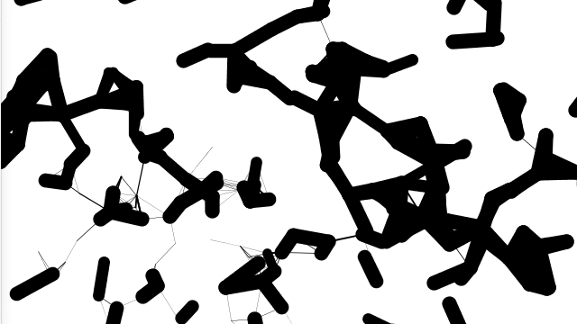

**Trying to Understand the Code**

*Special Thanks to Brian who helped me interpret the code*

In this assignment, I mainly focused on understanding the code. However, I found it quite difficult to do that. I tried to decrease the number of rotaters in the array to see what's going on, however I failed. So I turned to Brian for help. After his detailed explanation, I found the main problems reside in the way I interpret the variable names and function names. I anticipated the rotation() function to be similar to the examples professor Sherwood that the rotation of one "line" is related directly to the position and moving trajectory of the mouse. I also  thought the rotaters are individual lines. These impressions make the code incomprehensible. 

Finally, I understood it. The rotaters are actually many invisible dots of which x and y positions are randomly assigned within the range of width and height. Once they are assigned with a fixed position one after another in the array, their individual position before update (or "rotation") is fixed. The function "rotation ()" is more like an update than a real-life rotation, and the variable "angle" is not actually an angle or something like "heading" but something results from the updating position of each dot (or rotater) and the updating of the dots will change the distance between their current position and their original position. Once the distance is smaller than the assigned "lineDistance" of that dot (or rotater), a line will be drawn between the current location and their original location. The rotation or update has nothing do with the mousePos except for the acceleration caused by it.The acceleration will change the speed will change the angle and the angle through sine or cosine will update the location of the dots. 

Finally, I made two small changes:

1. I change "if (dist(mouseX, mouseY, x, y)<100 && mouseX!=pmouseX && mouseY!=pmouseY)" into "if (dist(mouseX, mouseY, x, y)>200", I not only change "<" into ">" but also delete the condition of "mouseX!=pmouseX && mouseY!=pmouseY". In this case, if your mouse moves to a position and stop it, the lines around and close to your mouse will slow down and remain static as if you capture it.

2. The weight of the stroke is set accoding to the speed of the rotater, becase the speed is so small so I make the difference obvious by mapping it and setting the range 0-500. In this case, the slower the rotater is, the thinner the line is.

