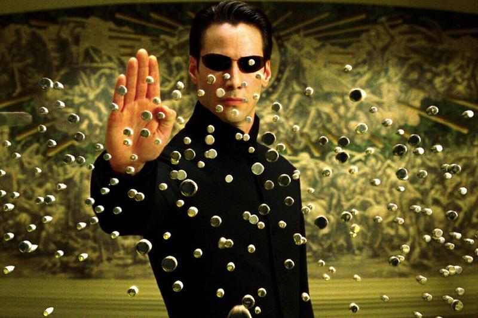
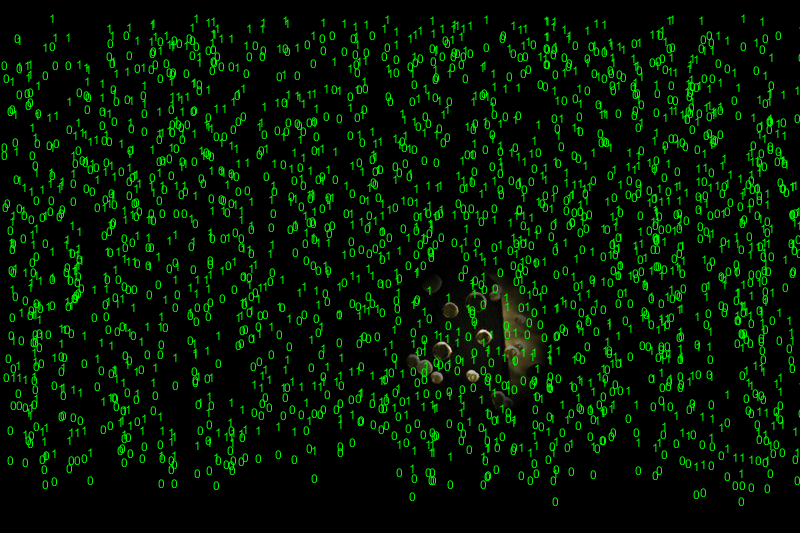

**The Matrix**

**Description**

In this project, I mainly used an array and an spotlight effect. More specifically. I created an array of text "0" and "1" and called the class
"Line". Visually, these green characters would move from the top to the bottom and since there were many of them so they created an effect that
resembled the iconic matrix image. Also by using the spot light effect, one could explore the image behind the green characters.
It is easy to figure out that it's a famous scene of the leading character.

**Questions**

1. The spotlight effect is achieved by using essentially mapping "float factor =map(d, 0, 80, 3, 0);// it means if the distance between the pixel and the mouse position is between 0 and 80, the closer to the mouse position the brighter it will be" and then it factor will be used to multiply each pixel's r,g,b respectively. However, I found that if I change 3,0 into 3,1.2, it would be as of I enlarge the radius. Why did this happen? Shouldn't it be the effect that the outer most ring of pixels are bit lighter but the radius remains unchanged? Also why the pixels outside the spotlight part would be black? In my understanding, it can only control the pixels within the radius which is 80 in this situation. I think I understand map function wrongly.

2.Why by multiplying r,g,b it would get brighter? In my understanding, they are still three numbers (onenumber, onenumer, onenumber). Are (90,120,150) and (30*3,40*3,50*3) different?
