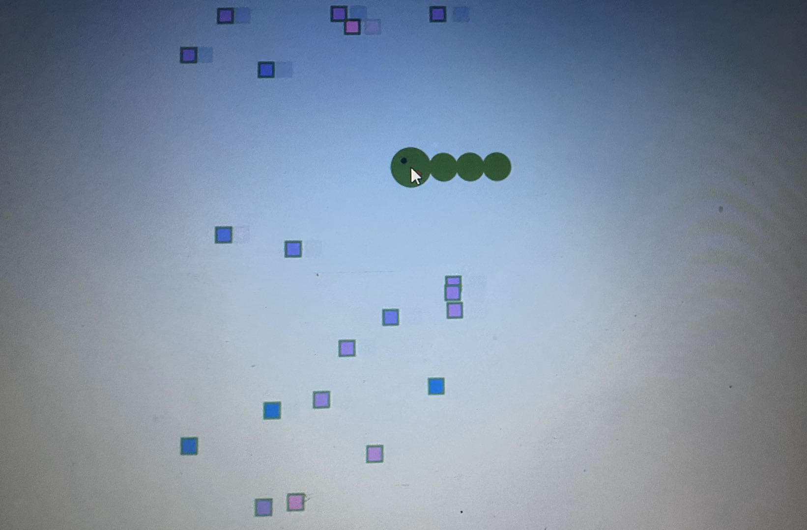

**The Candy-eating Bug**

This time I made a game in which a bug was trying to eat candies. If it managed to eat one candy (that is the outside of the square-like candy is included within the bug's head), the radius of the bug's head would get largger showing that it would grow after eating the candy. Also, the position of the bug (that is the center of its head) is decided by the x,y position of the mouse. It moved with the mouse. All the square-like candies would come from the left side of the screen and move with different speed. I created two classes which are "Bar" (candy) and "Bug". I also made the candies into an array. Details can be seen in the codes and comments.

**Picture of the Bug**

**Difficulties**

I tried but I didn't find a way to make the candies disappear after being eaten by the bug, so I can score high simply by dragging the bug at the same speed along with just one or two candy and the bug will get bigger and bigger and score even higher. How to make them disappear?
