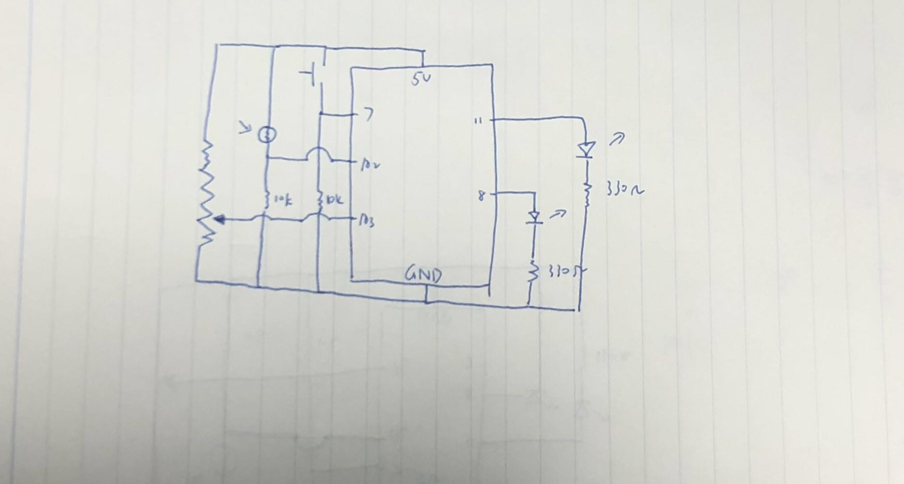
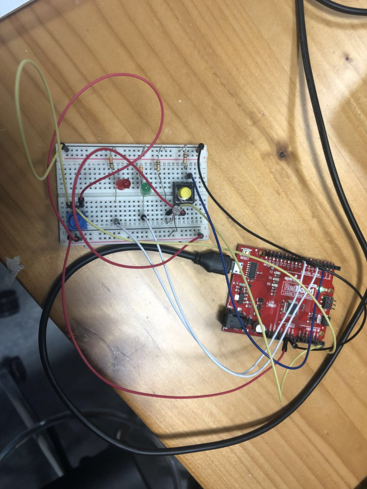

*AssignmentTwo Description*

*Description:*

In this program, I want the LEDs to blink if the momentary switch is LOW, and the speed of the blinking should be 1/10 of the sensorValue which is the analogRead of the potentiometer. Then if the momentary switch is HIGH, both LEDS should give off light and the brightness should be proportional to the lightValue which is the mapped value of the photoresistor.

*Problems:*

At first I wasn't able to print the sensorValue, after asking the Lab assistant for help, I knew I have to include the "int buttonState = digitalRead (7);" inside of the loop.
Secondly, if I want to define a function, like the doTheBlink, I have to do it outside of the loop.

*Extension:*
I want to do somethinf that is if the sensor value is smaller than certain amount, the light will change.

*Schematics:*

*Project*

