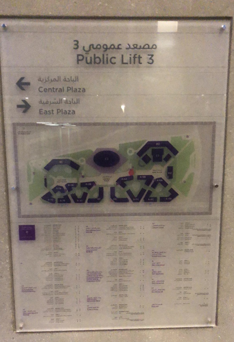
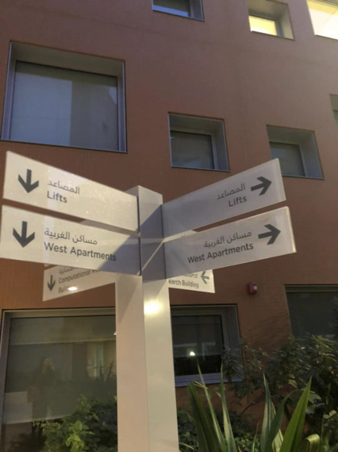
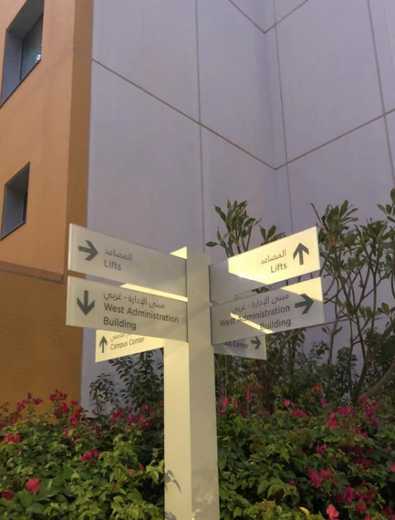

**Interactive Observation**

Interactions that I observed on campus are route signs. I always believe that reading or designing and arranging route signs are interactive and never uni-directional. It is like you are asking the route from a static sign instead of a lively human which requires higher accuracy and readability of the design. Here are some pictures I took at the campus: Comparatively, this is the best route sign on campus. It is located out of the elevator on the main route connecting D1 and D2. It provides the reader with a holistic view of how the buildings are located, and offers the relative position among buildings, names of the buildings, and shapes of the building. It also contains some important locations or offices in each building. In this way, the readers can relatively find the way easily.

However, some designs add more confusion than clarification. These route signs are extremely common within the student residential area. First of all, it doesn’t satisfy some of the crucial needs of the readers. I always want to know how to get to A5C or A6B, however, the route signs in this area don’t offer the direction and location of different residential halls. It can be defended in a way that all the residential halls are arranged from a small number to a big number which means walking along the road you will see the pattern and find the place. However, this doesn’t work when the visitors are completely new to the campus or when a student comes up from a random stairs and suddenly see him/herself among three residential halls of the same number (eg. A5C, A5B, A5A) but wanting to decide either the right path or the left path will lead to his/her own residential hall (eg. A1B). Also, the flaw of the designs seems to be clear that on one sign, there are two different directions leading to the same location. Moreover, the signs are not located at stairs or crossings which make this possible.

