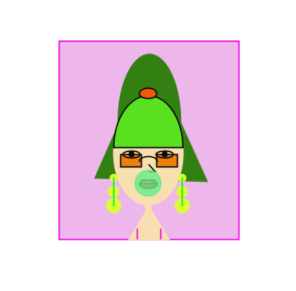
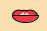

**Self-portrait:**

This is my self-portrait which mainly includes ellipse, circle (a type of ellipse), rectangle, triangle, arc, and line commands.More detailedly, some arcs are closed by chord to draw shapes like the fringe and the lower lip. All the colors are achieved by using the command fill (R,G,B) with reference to online color picker. The stokeWeight is set to be strokeWeight (2) to make the lines seem stronger.The effect of noStroke in some shapes is achived by seeting the stroke color same as the fill of the shape.

The interesting parts of my portrait are: 1. The **changing color sun glasses**. It is achieved by using the random command within the fill setting of the sun glasses: fill (237, random (55, 144), 14); In this way it will randomly change color within a certain range.
2. The blowing bubble gum. The **radius of the bubble gum will change** according to "mouseX" which is mapped from "0-width" to "10-80". Generally, the radius will increase when you move the mouse from left to right but the bubble will **pop** when your mouse is too right (mouseX >700).

**Here is the picture of my portrait:**

**Problems I faced:**

1.I used this command: "arc(400, 310, 14, 9, radians(250),radians(280))" to fill the part between two upper lips with a small arc but didn't find it effective; however, this gave me the inspiration of the bubble gum.

2.Is it true that no matter where you put the command about stroke eg. noStroke() or strokeWeight(), it will change the stroke setting for all the strokes? Is there any other solution to navigate this except changing the stoke color to the same color as the fill of the shape to create an illusion of no stroke?

