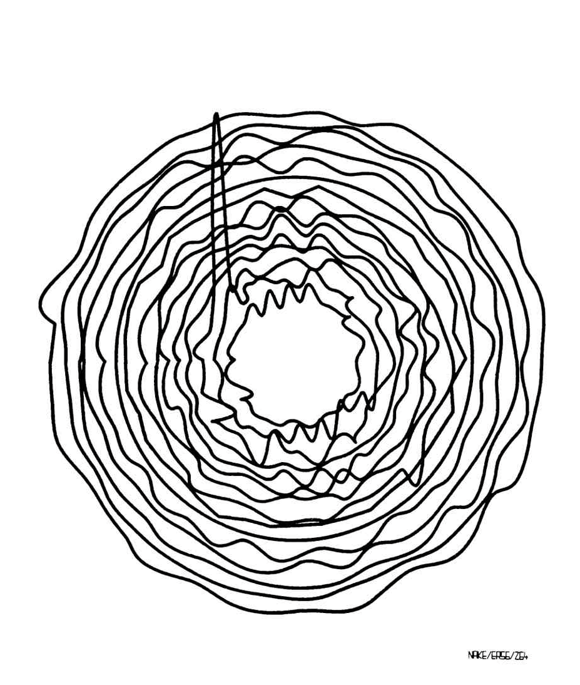
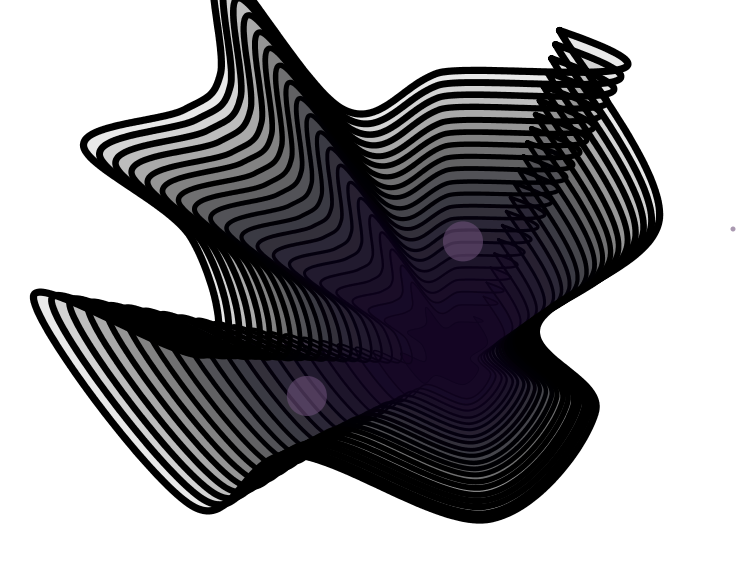

**Irregular Circle**

In this assignment, I tried to imitate the drawing style of the following picture from http://dada.compart-bremen.de/docUploads/ProgrammInformation21_PI21.pdf.

I created a function in which I drew an irregular circle by drawing continuous spline curve with reference to https://processing.org/tutorials/curves/and. After that, I created a loop, in which I not only called the function but also used translation and scale to draw multiple increadsingly bigger irregular circles. The color of the circles would get closer to black while the opacity will be lower with its increasing size.

After this, I drew two moving circles using the concept of perlin noise. It was achieved by mapping the position according to noise (t) ,in which t is time and t=t+0.2. Using another mapping which mapped the opacity according to the postition of the circle, the opacity of the circle would get larger when approaching the center of the irregular circle. Here is the [video](https://youtu.be/z62_iZN2jJI)

This is the picture of my assignment

