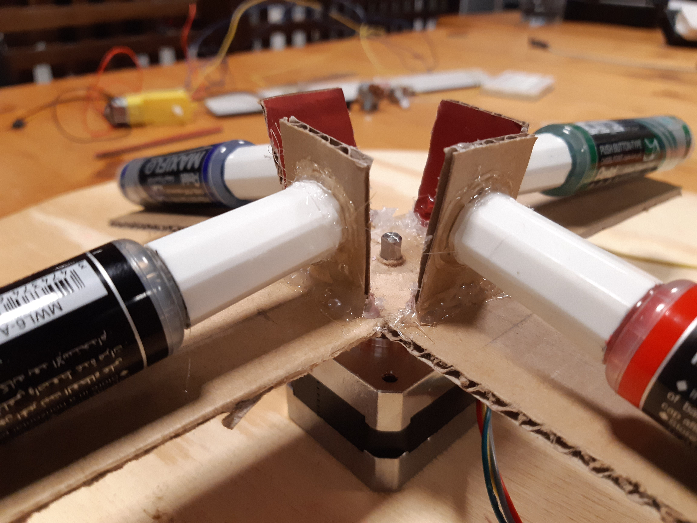
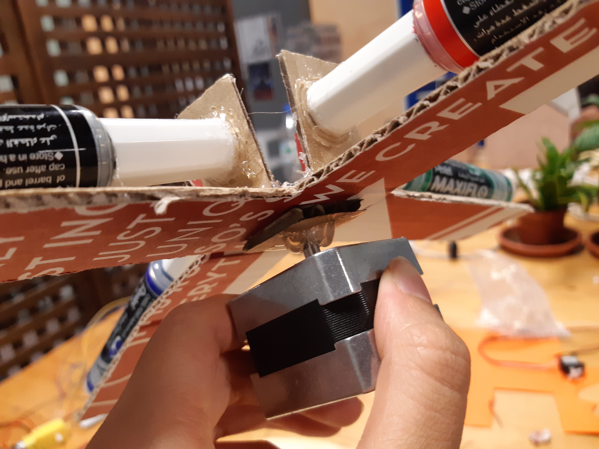
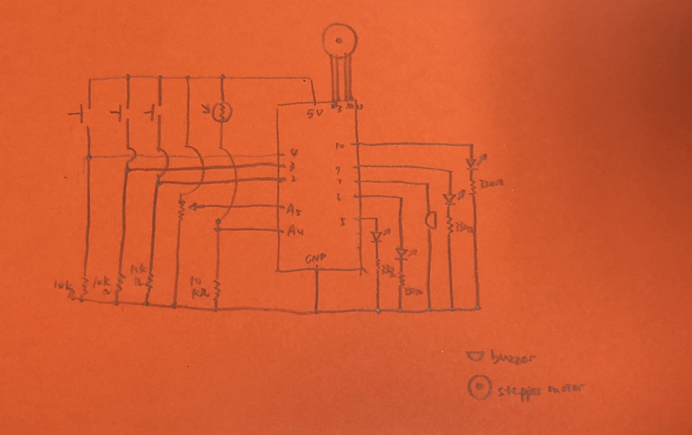

**Name of the project:**

"Pen Delivery Machine"

**Detail Description**

This project contains two major parts: 1. A cross-like pen delivery machine and 2. The circuit.

*The cross-like pen delivery machine part:

Step 1: A cross-like shape (r = 14cm) was cut out of cardboard. Four smaller rectangular (3cm * 2.5cm) pieces were cut and hotglued to the cross-like shape cardboard as pen holders. 

Step 2: Four pens's caps were hotglued to the four smaller rectangular pieces.

Step 3: A small square (2.5cm * 2.5cm) piece with a small hole in the center was cut and hotglued to the stepper motor through the hole.

Step 4: Use super glue to stick the cross-like shape to the small square piece (which was glued to the stepper motor).

Step 5: Now the pens, the cross-like pen holder, and the stepper motor all move together!

*The circuit part:

Three buttons (red, blue, and green) were connected to pin 3,2,4 respectively. Four LEDs (green, yellow, red, and blue) were connected to pin 10,9,6,5. A buzzer was connected to 7. A potentiometer was connected to A5. A light sensor was connected to A4. An Adafruit Motor Shield V2 was connected to the red board and the stepper motor is connected to it like this:

**How does it work?**

Basically, if someone approach the delivery machine (analogRead of potentiometer is lower than 900), the whole process will start. The LEDs will blink in order (green, yellow, red, blue) and the delay amount (or visually speaking "speed") can be controlled by potentiometer. The default is the black pen facing forward, and if you press the green button, the stepper motor will turn 180 degree clockwise to deliver the green pen and go back to the default position. If the blue button is pressed, the stepper motor will turn 90 degree counterclockwise to deliver the blue pen and go back to the default position. If the red button is pressed, the stepper motor will turn 90 degree clockwise to deliver the red pen, and the buzzer will play some melody to imply that the teacher is using red pen to underline something important and then go back to the default position. 

Here is the link of my project
[video](https://youtu.be/E5f5ftX6dHM)

**Difficulties**

Difficulty 1: How to find a motor that can turn more than 180 degree and can hold heavy penholder and pens. After asking the peers and professor, I used the stepper motor. In order to make it work, I had to use the adafruit motor shield V2 to connect the stepper motor with the red board. Also I have to download files about the adafruit motor shield V2 from the library and use the code example: stepper test.

Difficulty 2: How to attach the cross-like pen holder to the stepper motor firmly? At first I tried to directly hotglue it to the stepper motor, however after running the loop for about 30 times it became loose. Then I came up with a way. The main point was to increase the area that can make full and firm contact. So I firstly cut a small square (2.5cm * 2.5cm) piece with a small hole in the center and hotglued to the stepper motor through the hole with a lot of hotglue in the hole and at the back of the square piece (see the picture). Then I used super glue to stick the cross-like shape to the small square piece. It works perfectly fine now.

Difficulty 3: REMAIN UNSOLVED! I want to attach the stepper motor to the platform wood board. However, neither hotglue nor ziptag works. Both of them can make the stepper motor stay on the board stably, however, once the stepper motor was fixated to a fix position, it started figetting or not turning/functioning well. I don't know why.

**Schematic**

**Photos of the project**

